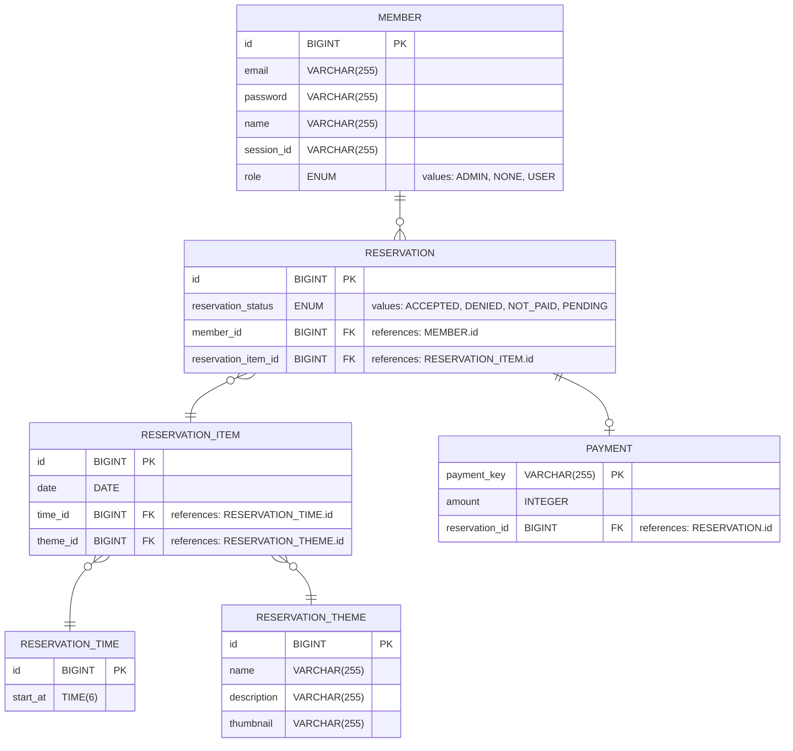

```mermaid
erDiagram
    MEMBER {
        id BIGINT PK
        email VARCHAR(255)
        password VARCHAR(255)
        name VARCHAR(255)
        session_id VARCHAR(255)
        role ENUM "values: ADMIN, NONE, USER"
    }

    RESERVATION {
        id BIGINT PK
        reservation_status ENUM "values: ACCEPTED, DENIED, NOT_PAID, PENDING"
        member_id BIGINT FK "references: MEMBER.id"
        reservation_item_id BIGINT FK "references: RESERVATION_ITEM.id"
    }

    RESERVATION_ITEM {
        id BIGINT PK
        date DATE
        time_id BIGINT FK "references: RESERVATION_TIME.id"
        theme_id BIGINT FK "references: RESERVATION_THEME.id"
    }

    RESERVATION_THEME {
        id BIGINT PK
        name VARCHAR(255)
        description VARCHAR(255)
        thumbnail VARCHAR(255)
    }

    RESERVATION_TIME {
        id BIGINT PK
        start_at TIME(6)
    }

    PAYMENT {
        payment_key VARCHAR(255) PK
        amount INTEGER
        reservation_id BIGINT FK "references: RESERVATION.id"
    }

    MEMBER ||--o{ RESERVATION: ""
    RESERVATION }o--|| RESERVATION_ITEM: ""
    RESERVATION_ITEM }o--|| RESERVATION_TIME: ""
    RESERVATION_ITEM }o--|| RESERVATION_THEME: ""
    RESERVATION ||--o| PAYMENT: ""
```
